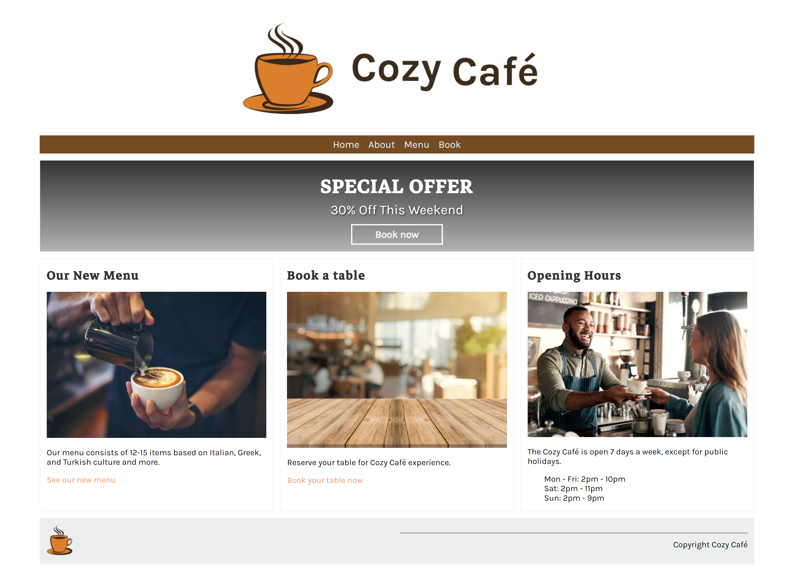
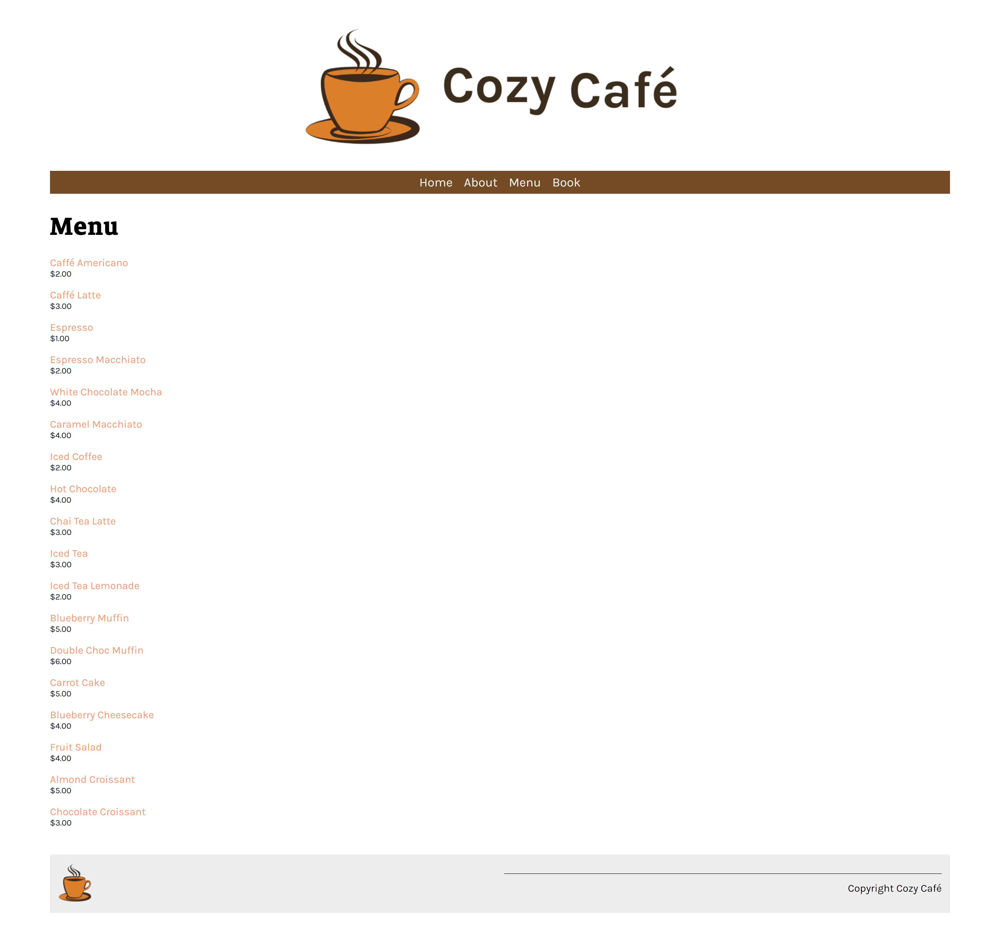
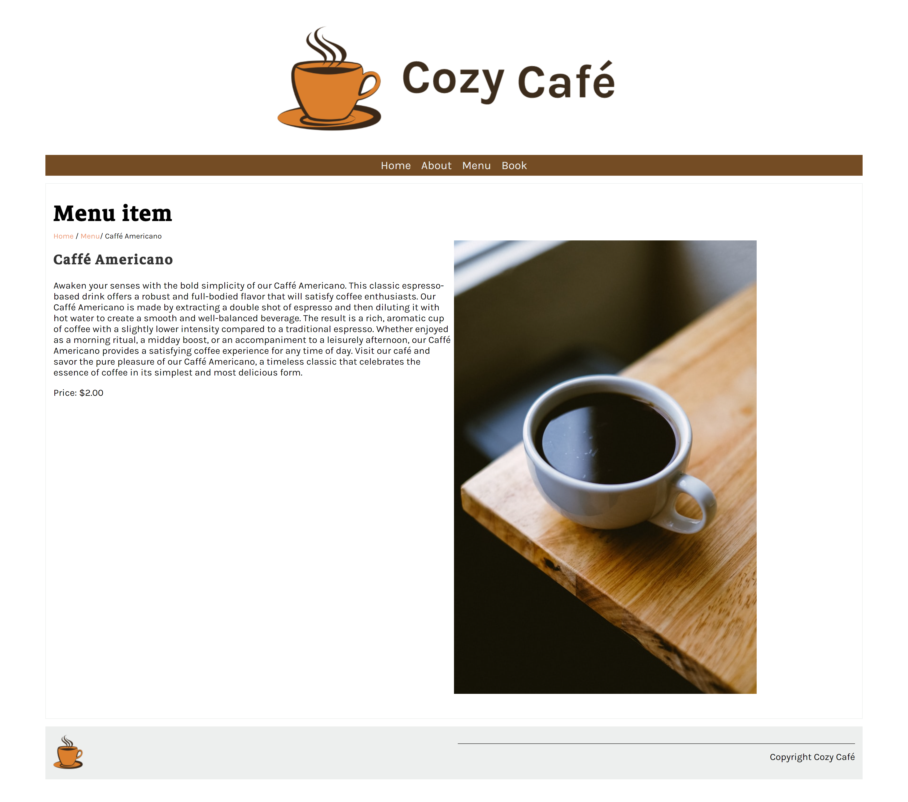
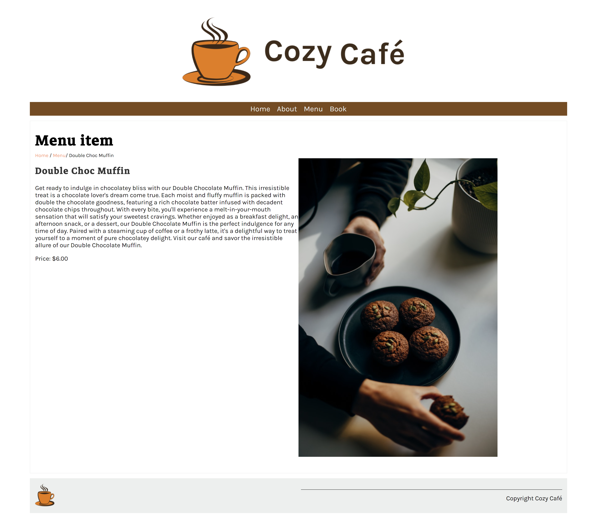
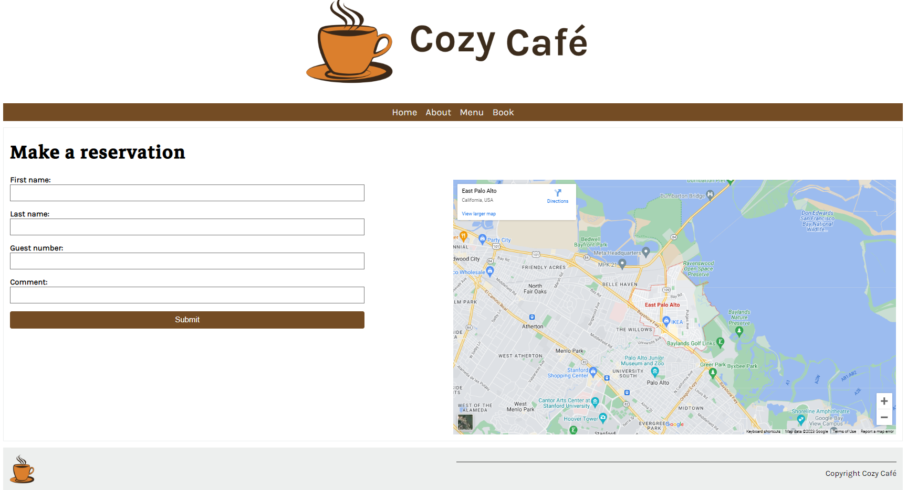

<h1 align=center >Cozy Café Website</h1>

<small>Picture Source: <a href="https://unsplash.com/photos/Dlj-SxxTlQ0">unsplash</a></small>

 

Welcome to the Cozy Café website! This repository contains the code and assets for the Cozy Café, a delightful café located in the heart of vibrant San Francisco, California. The website showcases our menu, café information, and allows customers to book their visits.

## Introduction

Cozy Café is a haven for dessert and coffee lovers seeking a modern twist. Our café is dedicated to crafting delicious treats and serving exceptional coffees that will delight your taste buds and warm your heart. With a cozy and inviting space, we strive to create an atmosphere that sparks joy and connection.

## Features

-   **Home:** Get a glimpse into the warm and inviting ambiance of Cozy Café, with information about our café's menu, booking, working hours and commitment to excellence.
-   **About:** Discover the inspiring journey of our café owner, Hunter Doohan, and their unwavering passion for coffee. Learn how Cozy Café came to life and became a beloved part of the vibrant San Francisco culinary scene.
-   **Menu:** Explore our carefully curated menu, featuring a diverse selection of 18 drinks and desserts. From rich and bold coffees to decadent cakes and delicate pastries, there's something to satisfy every palate.
-   **Book:** Easily make a reservation to secure your spot at Cozy Café. Whether you're catching up with friends, seeking a moment of solitude, or simply treating yourself to a well-deserved indulgence, our café offers the ideal setting for your escape.

## Technologies Used

The Cozy Café website was developed using the following technologies:

-   **Django:** The powerful Python-based web framework for building dynamic and scalable web applications.
-   **SQLite:** A lightweight and user-friendly database management system used to store café information and manage reservations.

## Installation

To run the Cozy Café website locally, follow these steps:

1.  Clone this repository to your local machine.
2.  Install the necessary dependencies by running `pip install -r requirements.txt`.
3.  Configure the SQLite database according to your setup and populate it with the café information.
4.  Create virtual environment `python -m venv venv`.
6.  Start the Django development server by running `python manage.py runserver`.
7.  Access the website by navigating to `http://localhost:8000` in your web browser.
8.  You may create a superuser to add groups and menu items. For that, you must type `python manage.py createsuperuser` in your terminal.

## Contribution

We welcome contributions to enhance the Cozy Café website. If you have any suggestions, bug reports, or feature requests, please open an issue or submit a pull request. Let's collaborate to make Cozy Café even better!

## License

This project is licensed under the [MIT License](https://chat.openai.com/LICENSE).

## Website Preview

### Home

### About

### Menu

### Menu Item / Caffé Americano

### Menu Item / Double Choc Muffin

### Booking

<h2>Contact Me</h2>

If you have something to say to me please contact me:

<ul>
	<li>Twitter: <a  href="https://twitter.com/Doguilmak">Doguilmak</a></li>
	<li>Mail address: doguilmak@gmail.com</li>
</ul>
